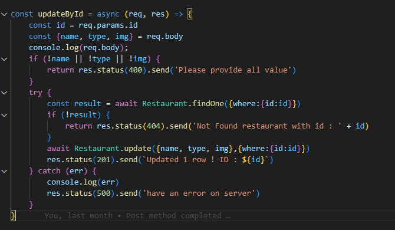

# Restaurant Restfull API
* Author : **Nattaphong Sriphaophan**

หน้า db.config.js  คือการใส่ค่าเชื่อต่อ database

หน้า controller จะมี 5 function 
1.getAll คือ การดึงข้อมูลทั้งหมดมาแสดง

2.getById คือ การดึงข้อมูลด้วยหมายเลข id มาแสดงเท่านั้น

3.creatRes คือ การสร้าง restaurant ใหม่

4.deleteById คือ การลบข้อมูล โดนอิงจาก ID

5.updateById คือ การแก้ไขข้อมูลโดยอิงจาก ID

และ export function ออกไปใช้งาน

หน้า db คือการเชื่อต่อ database และ เช็คการเชื่อต่อ database

หน้า Router คือการนำทางในนี้จะเป็น URL หรือเป็นเส้นทางขอหน้าเว็ปเรา

หน้า server มีหน้าที่ on server 
